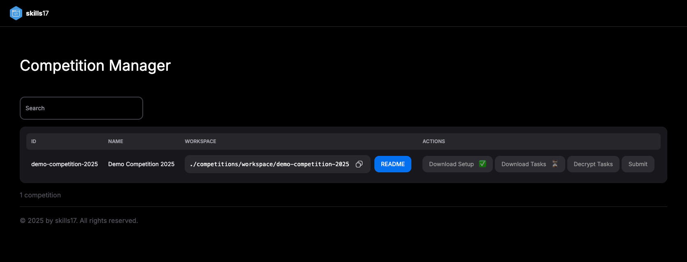

# Skill 17 - Competition Environment

Competition environment for competitors.


- Are you planning to take part in a competition in Web Technologies — Skill 17?
- Did the organizers of the competition provide you with a link to this repository?

Then you are in the right place!

What can be found here?

- Instructions on how set up your environment for the competition.
- Example problems to test your setup.
- Instructions on how to submit your solution.

Please go through these instructions and verify your setup before the competition starts.

- __It is important that you go through the instructions several days before.__
- __Make sure you test your setup in the same network as you will be doing for the actual competition. School or
  corporate networks might cause proxy issues.__
- In case there is an issue, you have time to resolve it or contact the organizers.

## Screenshot of Competition Manager

[](screenshot.png)

## Instructions

__Quick Start__:

```bash
git clone git@github.com:skills17/competition-manager.git
cd competition-manager
docker compose up -d
open http://localhost:9999
```

### 1. Installation

1. Install Docker if you haven't already. [Get Docker](https://docs.docker.com/get-docker/).
2. Install Git if you haven't already. [Get Git](https://git-scm.com/downloads).
3. Install Node.js LTS if you haven't already. [Get Node.js](https://nodejs.org/en/download/).
4. Optional: If you want to use PHP to solve the backend tasks:
    1. Install [PHP](https://www.php.net/downloads.php) or use a package manager like Homebrew on macOS or
       Chocolatey on Windows.
    2. Install [Composer](https://getcomposer.org/download/).
5. Clone this repository:
   - Via SSH: `git clone git@github.com:skills17/competition-manager.git` (recommended)
   - Via HTTPS: `git clone https://github.com/skills17/competition-manager.git`

Hints:

- Make sure that Docker is running with at least 4 GB of memory.
- Make sure that you have enough disk space available. To be on the safe side, check that you have at least 20 GB
  available.
- Make sure that Docker has access to the folder you cloned this repository to. You might need to add the folder to the
  list in Docker Desktop under Resources > File sharing.
- Windows: Make sure you enabled
  [Developer Mode](https://learn.microsoft.com/en-us/windows/apps/get-started/enable-your-device-for-development).
  This is required to run Node.js and PHP commands. Otherwise, you might encounter `EPERM` errors.
- Optional: If you worked with Docker before, you might want to prune your system first:

```bash
# Stop all containers (requires bash, on Windows: use Git Bash or Bash for Windows)
docker stop $(docker ps -a -q)
# Remove all unused containers, networks, images, and anonymous volumes.
docker system prune --all --volumes
# Remove all non-anonymous volumes (make sure you don't need any of them).
docker volume prune --a
```

### 2. Starting the environment

1. Open a terminal and navigate to the directory of this repository.
2. Run `docker compose up -d` to start the environment.
3. Wait a few seconds and verify that the environment is healthy by running `docker ps`.

You now have a running environment with all the tools you need to fetch, solve and submit the tasks.

The following ports are exposed:

- `9999`: The web server for fetching the tasks and instructions as well as submitting your solution.

Hints:

- If you get an error that the port is already in use, you might have another service running on port 9999. You need to
  stop that service or change the port in the `docker-compose.yaml` file.

### 3. Fetching the competition tasks

On the started server [http://localhost:9999](http://localhost:9999), you can fetch the tasks for the competition.
Please do so before the competition starts. A hash is also provided to verify the integrity of the tasks. If the
competition tasks are not yet available, please check again a few days before the competition starts.

The downloaded tasks are encrypted and can only be decrypted with a password provided by the organizers. You will be
given the password at the start of the competition. This allows you to download the tasks in advance and start solving
them as soon as the competition starts.

### 4. Decrypting the tasks

Once you have the password, you can decrypt the tasks on the website [http://localhost:9999](http://localhost:9999).

Instructions on how to solve the tasks can be found on the displayed link after successfully decrypting the tasks.
The setup can differ from competition to competition. You probably will need to start another set of Docker containers.

The decrypted tasks will be available locally in the `competitions/workspace/:competition/` directory.

### 5. Uploading your solution

You can upload and submit your solution as many times as you want. Only the last submission will be considered.
Submissions after the deadline, that was communicated to you by the organizers, will be ignored.

To submit your solution, open a browser and navigate to [http://localhost:9999](http://localhost:9999). Select the
competition you want to upload your solution to and click on `Submit`.

### 6. Stop the environment

The containers are running in the background. You can stop them with `docker compose down` while being in the directory.

## Troubleshooting

Got an issue?

1. Check if it is listed here [TROUBLESHOOTING.md](TROUBLESHOOTING.md).
2. Check if someone else already had the same issue on the GitHub
   repository: [Issues](https://github.com/skills17/competition-manager/issues)

Still stuck? Create an issue on this GitHub repository here:
[Create Issue](https://github.com/skills17/competition-manager/issues/new)
